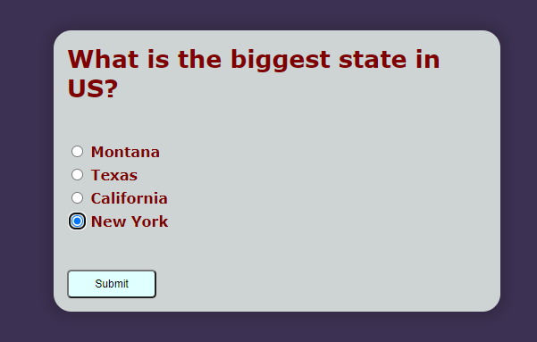
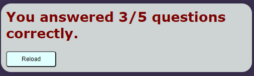

# QuizApp - Selection Model

Background:

I picked this project to practice JavaScript.

I create 5 multiple choice questions a user can select from.

Once they have answered all the questions, the results are displayed.

